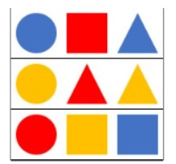
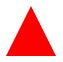
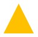
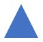
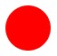
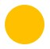
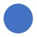
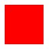

# SpecEdc
try
<!DOCTYPE html>
<html>
  <head>
    <meta charset="utf-8">
    <title>My test page</title>
	
  </head>
  <body>
	

	<h1>聽覺活動：聆聽指示</h1>
	
請按音樂中老師的指示體驗

	
	
	

	

	
	
	
	
	
	
	
	
	
	
	
	
	
	

	<button id="demo" onclick="myFunction()">按我體驗</button>
	<button id="try" onclick="answer()","">點我看答案</button>
  </body>
</html>
